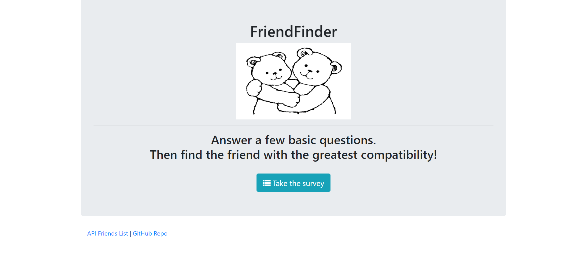

# FriendFinder Web App


## live App Link
 - https://friendfinder-faran.herokuapp.com/

 ## How to use

 

 

 To use this app, simply go to the homepage, click on the survey button and take the state-of-the-art survey. Immediately after submitting the survey, your perfect best friend will pop up. Also there is an API link for accessing to the network's users and their personalized information. (Only for research purposes.) * if you are running this application don't forget to run *

 ```git
    $ npm install
 ```

 ## Technologies Used

- JavaScript
- jQuery
- node.js
- Express.js
- HTML
- Bootstrap

## Code Explanation
- Our `server.js` file sets up the Express server, specifying our port number, the npm packages that need to be loaded, and also the routes, which we have externalized
- There are 2 separate HTML files (`home.html` and `survey.html`) that serve as the front-end portion of our code.
- Our 2 routing files (`htmlRoutes.js` and `apiRoutes.js`) determine the back-end logic (based on the request being made, the response that gets sent to the browser); the HTML routes display the survey and the homepage based on the URL that is accessed, and the API routes send back existing content in our server-side data or add new friends
- Best match is calculated by finding the friend with the minimal difference in scores and then sending that friend to the browser as a JSON object
- A modal is then toggled, displaying the the best match to the person who just took the survey
- Friends are stored as such:

```json
{
	name: "Sam",
	photo: "Photo link here",
	scores: [5, 1, 2, 3, 5, 5, 5, 3, 1, 2]
}
```